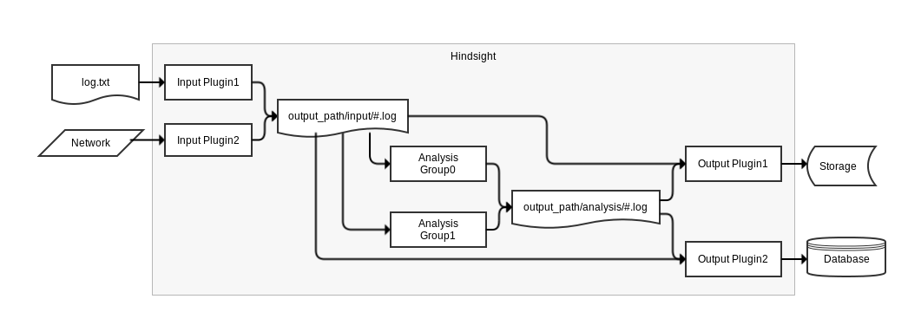

# Architecture

Hindsight consists of three types of plugins: Input, Analysis, and Output. All
plugins are written in Lua and based on the
[Lua Sandbox](https://github.com/mozilla-services/lua_sandbox) project.

## Input Plugins

Input plugins are used to transform external data formats into a Heka messages
for processing.  Each input plugin runs on a dedicated thread and all messages
generated by the plugins are multiplexed to a single output stream.

## Analysis Plugins

Analysis plugins are used for simple or complex event processing such as:
aggregation, sessionization, anomaly detection etc.  Analysis plugins can share
a thread of execution; the work distribution across threads is user configurable
and can be tailored to specific use cases and needs e.g., by performance
characteristics, work load distribution or type. Every analysis thread uses a
dedicated reader to process the data stream produced by the input plugins. The
messages generated by all analysis plugins are multiplexed to a single output
stream.

## Output Plugins

Output plugins are used transform the internal Heka messages into whatever
format is needed e.g., txt, html, tsv, alternate binary encoding. The
message/transformation can then be feed to other systems such as data
warehouses, information retrieval indexes, dashboards, notifiers etc. Each
output plugin runs on a dedicated thread and has its own readers to process the
data stream produced by the input and analysis plugins. If the output plugin is
subscribed to both the input and analysis streams they are multiplexed with the
oldest message being delivered first.

## Sample High Level Data Flow



## Reliability

### Durability

The durability of the data is equal to durability of storage where the
`output_path` (data stream files and state preservation files) is configured.

### Delivery Guarantee

The at least once delivery guarantee only applies to software failures. There
are no guarantees if the underlying storage system fails. Crashing or killing
the Hindsight process should not cause any messages to be lost or skipped and
will, at most, duplicate/re-process one second of data on restart. However,
sandbox state is only preserved on a clean shutdown i.e., if an analysis plugin
was counting the number of messages going through the system, and the system was
killed, the count would be reset to last saved state. This behaviour should be
taken into account for any plugins performing and preserving stateful analysis.

### Dynamic Plugin Loading

The Hindsight infrastructure can be run as a service with no initial business
logic loaded since all plugin types can be dynamically loaded and unloaded as
necessary.

```lua
sandbox_load_path = "hs_load"
sandbox_run_path  = "hs_run"
```

### Starting a New Plugin

1. `cp test.lua hs_load/analysis/test.lua`
1. `cp my_test.cfg hs_load/analysis/my_test.cfg`
1. `cp your_test.cfg hs_load/analysis/your_test.cfg`
1. *Hindsight scans the directory*
1. test.lua is moved to hs_run/analysis/test.lua
1. my_test.cfg is moved to hs_run/analysis/my_test.cfg
1. Hindsight attempts to run my_test.cfg
1. your_test.cfg is moved to hs_run/analysis/your_test.cfg
1. Hindsight attempts to run your_test.cfg

### Restarting a Plugin

1. `cp my_test.cfg hs_load/analysis/my_test.cfg`
1. *Hindsight scans the directory*
1. my_test.cfg is moved to hs_run/analysis/my_test.cfg
1. Hindsight attempts to restart my_test.cfg (no data gaps/loss)

### Updating the Business Logic

1. `cp test.lua hs_load/analysis/test.lua`
1. *Hindsight scans the directory* 1. test.lua is moved to
hs_run/analysis/test.lua
1. Hindsight attempts to restart my_test.cfg and your_test.cfg since they use
the same underlying business logic (no data gaps/loss)

### Stopping a Plugin

1. `touch hs_load/analysis/my_test.off`
1. *Hindsight scans the directory*
1. hs_load/analysis/my_test.off is deleted
1. hs_run/analysis/my_test.cfg is renamed to hs_run/analysis/my_test.off
1. Hindsight stops my_test.cfg
